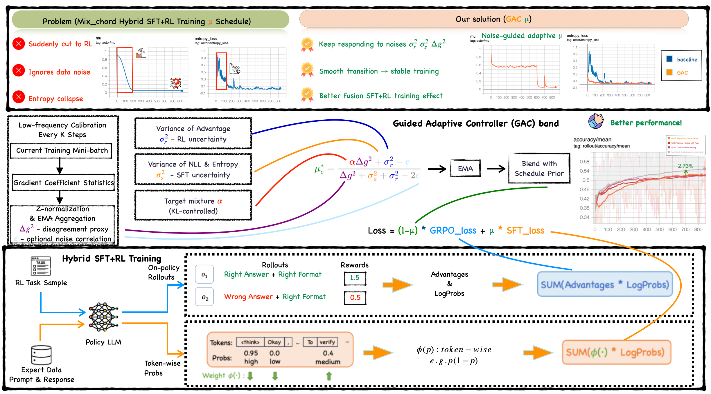
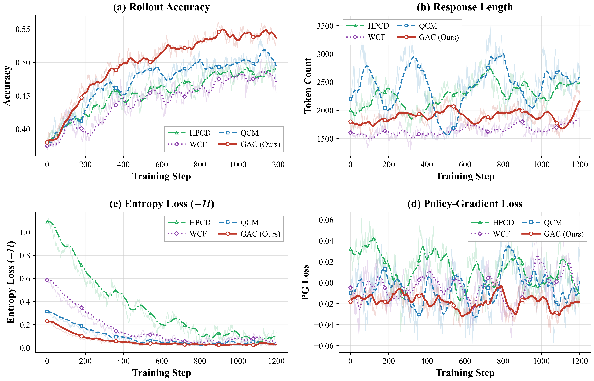
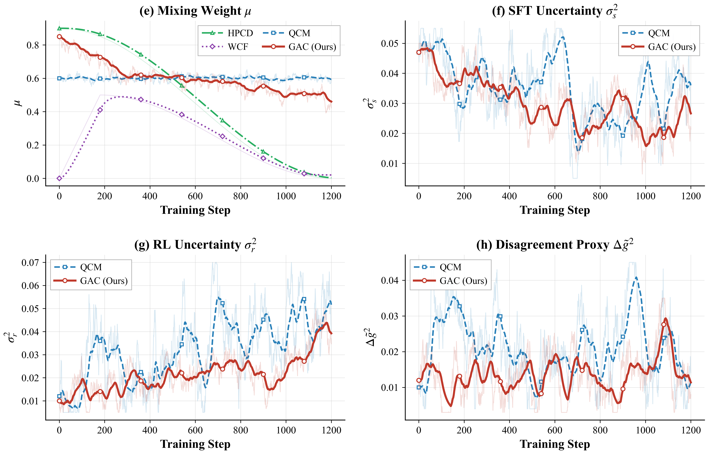

<div align="center">

# 🎼 GAC
### Noise-Aware Adaptive Mixing for Hybrid SFT–RL Post-Training

[](https://2026.emnlp.org/)
[](#)
[](https://openreview.net/forum?id=VhBpT4iq60)
[](https://deepnovacore.github.io/GAC/)
[](https://opensource.org/licenses/Apache-2.0)

**A closed-form, noise-aware controller that adaptively balances SFT and RL — no hand-tuned μ schedule required.**

<sub>Yuelin Hu¹ · Wei Liu² · Zhenbo Yu¹,³ · Zhengxue Cheng¹ · Li Song¹</sub>
<sub><sup>¹</sup>Shanghai Jiao Tong University &nbsp;·&nbsp; <sup>²</sup>Shanghai Maritime University &nbsp;·&nbsp; <sup>³</sup>Novacore</sub>



</div>

---

## 📚 Contents

- [🔥 News](#-news)
- [💡 What is GAC?](#-what-is-gac)
- [✨ Key Highlights](#-key-highlights)
- [📊 Results](#-results)
- [🚀 Quick Start](#-quick-start)
- [🛠️ Reproducing Paper Results](#️-reproducing-paper-results)
- [📐 Method](#-method)
- [🗂️ Repository Layout](#️-repository-layout)
- [📝 Citation](#-citation)
- [🙏 Acknowledgements](#-acknowledgements)
- [📮 Contact](#-contact)

---

## 🔥 News

- **[2026/08]** 🎉 **GAC has been accepted to EMNLP 2026 Main Conference (Budapest)!**
- **[2026/08]** 📄 Camera-ready released. Reference implementation open-sourced under Apache-2.0.
- **[2026/09]** 🚧 *Coming soon*: full training / eval pipeline on top of VeRL + `gac-core` PyPI package.
- **[2026/09]** 🚧 *Coming soon*: Qwen2.5-1.5B / 7B / 14B GAC checkpoints on HuggingFace.

---

## 💡 What is GAC?

Hybrid SFT–RL post-training is the standard recipe for aligning LLMs — but the *mixing weight* **μ** between the two signals is almost always a **fixed, hand-tuned schedule**. This is fragile: when RL noise spikes, or when the SFT expert starts pulling the policy in a wrong direction, a static μ over-commits to whichever side is currently *less* reliable.

**GAC solves this by treating μ as an estimation problem.**

We derive a closed-form optimal μ that minimizes the MSE of the composite gradient under a signal-vs-noise decomposition:

<div align="center">

**μ\* = ( α<sub>tgt</sub>·Δg² + σ<sub>r</sub>² ) / ( Δg² + σ<sub>s</sub>² + σ<sub>r</sub>² )**

</div>

where **σ<sub>s</sub>², σ<sub>r</sub>²** are SFT and RL noise variances and **Δg²** is the SFT–RL disagreement. Since gradient-level quantities are prohibitively expensive at every step, we deploy three **coefficient-space proxies** estimated online from tensors any GRPO/PPO trainer already computes, wrapped in EMA smoothing, a cosine-schedule prior, and per-step change capping.

**Bottom line**: **+3.8 pp over HPT** (the previous best hybrid post-training method) averaged over math, code, science, and logic benchmarks, with **< 1% wall-time overhead**, **28% lower KL-drift area**, and gains that **grow with model scale** from 1.5B → 14B.

---

## ✨ Key Highlights

- 🎯 **Closed-form μ\***, derived from MSE-optimal gradient estimation — no meta-learning, no bilevel optimization, no extra hyperparameter grid.
- 📉 **Coefficient-space proxies**: three cheap signals (`σ_s²`, `σ_r²`, `Δg̃²`) that any PPO/GRPO trainer already has on hand.
- 🛡️ **Guarded controller stack**: EMA smoothing → cosine-prior blend → per-step change cap → hard clipping. Robust to mid-training regime shifts.
- ⚡ **< 1% wall-time overhead**: proxies are computed inside the existing forward pass, no extra network eval.
- 📈 **Consistent gains across scales**: **+2.2 pp @ 1.5B**, **+3.8 pp @ 7B**, **+3.3 pp @ 14B** on AMC vs. HPT (paper Table 3).
- 🔬 **Length-invariant by construction**: each sequence contributes exactly one scalar per proxy, so longer rollouts don't get extra vote weight.

---

## 📊 Results

### Table 1 · Mathematical reasoning & knowledge (Qwen2.5-7B-Instruct, 3 seeds, mean±std)

| Method | AMC | AIME24 | AIME25 | MMLU-Pro |
|---|:---:|:---:|:---:|:---:|
| Qwen2.5-7B-Instruct | 43.8 | 11.7 | 6.66 | 24.7 |
| SFT-best | 55.9 ±0.7 | 15.8 ±0.8 | 15.2 ±0.6 | 38.4 ±0.5 |
| DPO | 57.3 ±0.9 | 16.4 ±0.7 | 15.8 ±0.7 | 42.1 ±0.6 |
| GRPO (pure RL) | 52.1 ±1.4 | 13.2 ±1.1 | 8.54 ±1.0 | 45.8 ±0.9 |
| CHORD | 62.5 ±0.6 | 18.2 ±0.5 | 17.2 ±0.6 | 56.2 ±0.5 |
| SRFT | 61.8 ±0.7 | 17.9 ±0.6 | 17.0 ±0.7 | 55.6 ±0.5 |
| LUFFY | 63.1 ±0.6 | 18.5 ±0.5 | 17.6 ±0.6 | 56.0 ±0.5 |
| HPT | 63.4 ±0.5 | 18.7 ±0.5 | 17.8 ±0.6 | 56.4 ±0.4 |
| KL-ctrl | 62.8 ±0.8 | 18.4 ±0.6 | 17.6 ±0.7 | 55.8 ±0.6 |
| GAC w/o φ | 65.8 ±0.5 | 20.0 ±0.5 | 19.1 ±0.6 | 57.8 ±0.4 |
| **GAC + Token-φ (Ours)** | **67.2 ±0.4**† | **20.8 ±0.4**† | **19.8 ±0.5**† | **58.6 ±0.3**† |
| Δ vs. best baseline (HPT) | **+3.8** | **+2.1** | **+2.0** | **+2.2** |

<sub>†: joint p<0.05, Cohen's d>0.8 vs. best baseline. Paper Table 1.</sub>

### Table 2 · Code generation (pass@1 %, 3 seeds)

| Method | MBPP | HumanEval | Avg. |
|---|:---:|:---:|:---:|
| Qwen2.5-7B-Instruct | 68.4 | 72.0 | 70.2 |
| CHORD | 75.4 ±0.6 | 80.5 ±0.5 | 78.0 |
| LUFFY | 75.8 ±0.6 | 80.9 ±0.5 | 78.4 |
| HPT | 76.0 ±0.5 | 81.2 ±0.5 | 78.6 |
| **GAC + Token-φ** | **78.8 ±0.5**† | **83.5 ±0.4**† | **81.2** |
| Δ vs. HPT | +2.8 | +2.3 | +2.6 |

### Table 3 · Model scale experiments (AMC %, 3 seeds)

| Method | 1.5B | 7B | 14B |
|---|:---:|:---:|:---:|
| CHORD | 48.2 ±0.9 | 62.5 ±0.6 | 68.4 ±0.5 |
| HPT | 49.6 ±0.8 | 63.4 ±0.5 | 70.8 ±0.4 |
| GAC w/o φ | 51.4 ±0.8 | 65.8 ±0.5 | 73.2 ±0.4 |
| **GAC + Token-φ** | **51.8 ±0.7** | **67.2 ±0.4** | **74.1 ±0.4** |
| Δ vs. HPT | +2.2 | +3.8 | +3.3 |

<sub>Gains grow with model size — the noise-aware controller has more σ<sub>s</sub>²/σ<sub>r</sub>² dynamic range to exploit in larger models.</sub>

### Table 4 · Science (GPQA / SciBench) and Logic (BBH) — full breakdown in paper

| Domain | Best baseline | **GAC + Token-φ** | Δ |
|---|:---:|:---:|:---:|
| GPQA | 40.4 (HPT) | **43.5** ±0.5† | +3.1 |
| SciBench | 38.7 (HPT) | **41.2** ±0.5† | +2.5 |
| BBH-Logic (avg) | 62.6 (HPT) | **65.7** ±0.5† | +3.1 |

### Training dynamics

<div align="center">

<br><sub><i>Evaluation performance and rollout dynamics across benchmarks. GAC consistently leads from ~200 steps and maintains a moderate response-length regime (~1.6-2.0k tokens), avoiding the 2.5-3.0k length spikes indicative of reward hacking in baselines.</i></sub>
<br><br>

<br><sub><i>Controller state — μ trajectory and the three coefficient-space proxies. μ starts near 0.85 (SFT-dominated), gradually decreases to ~0.15 as training matures, and tracks σ<sub>r</sub>² rather than KL — confirming the noise-aware estimator drives μ during >93% of steps.</i></sub>
</div>

---

## 🚀 Quick Start

### Install

```bash
git clone https://github.com/deepnovacore/GAC.git
cd GAC
pip install -r requirements.txt
pip install -e .
```

The controller has **no framework-specific dependencies** beyond PyTorch. `torch.distributed` is used only if you have multi-GPU.

### Minimal integration (5 lines)

Drop the controller into any hybrid SFT–RL loop:

```python
from gac import AdaptiveMuController
from gac.sft_loss import SFTPhiLossFn
from gac.hybrid_loss import compute_hybrid_loss
from gac.controller import mu_schedule

controller = AdaptiveMuController(
    ema_beta=0.99,
    mu_change_cap=0.01,
    trim_ratio_sft=0.10,
    mu_update_freq=10,
    alpha_static=0.5,
)
sft_loss_fn = SFTPhiLossFn(token_level=True)

def training_step(batch, global_step, rl_loss_fn):
    # cosine-schedule prior on μ (peak → valley over training)
    prior = mu_schedule(
        global_step,
        warmup_steps=200, decay_steps=800,
        mu_peak=0.85, mu_valley=0.15,
    )
    # μ is inferred inside compute_hybrid_loss via the controller
    loss, logs = compute_hybrid_loss(
        logprob=batch["logprob"],
        action_mask=batch["action_mask"],
        advantages=batch["advantages"],
        expert_mask=batch["expert_mask"],
        rl_loss_fn=rl_loss_fn,          # your favorite PPO / GRPO surrogate
        sft_loss_fn=sft_loss_fn,
        controller=controller,
        global_step=global_step,
        schedule_prior=prior,
        blend_weight=0.5,               # λ in the paper — cosine-prior blend
    )
    return loss, logs
```

That's it. GAC only touches the **weighting between** the SFT and RL losses; it does not modify either loss itself. You keep your PPO / GRPO implementation, your RL infrastructure, and your reward model unchanged.

---

## 🛠️ Reproducing Paper Results

> **⚠️ Status (2026-08)**: This repo currently ships the **reference algorithm** — controller, hybrid-loss integration point, unit tests, and default config matching the paper. **Full training scripts, evaluation pipeline, and pretrained checkpoints are landing in v0.2 (targeted for late 2026-09).** See the [Roadmap](#-roadmap) section below.

For now, you can reproduce the *algorithm* end-to-end by wiring GAC into any GRPO/PPO trainer of your choice (VeRL, TRL, OpenRLHF, Trinity-RFT). The `configs/gac_default.yaml` gives you every hyperparameter in the paper's Sec. 4.1.

### Default hyperparameters

| Symbol | Config key | Value | Paper Sec. |
|---|---|:---:|:---:|
| β (EMA) | `ema_beta` | 0.99 | 3.4 |
| c̄ (per-step cap) | `mu_change_cap` | 0.01 | 3.4 |
| λ (cosine-prior blend) | `blend_weight` | 0.50 | 3.4 |
| f<sub>μ</sub> (update freq.) | `mu_update_freq` | 10 | 3.3 |
| trim ratio (SFT) | `trim_ratio_sft` | 0.10 | 3.3 |
| KL target | `kl_target` | 0.02 | 3.3 |
| α range | `alpha_range` | [0.10, 0.95] | 3.3 |

### Datasets used in the paper

| Domain | Dataset | Split |
|---|---|---|
| Math | OpenR1-Math-220k | 5k SFT prompts + 20k RL prompts |
| Code | MBPP, HumanEval | full eval |
| Science | GPQA, SciBench | full eval |
| Logic | BBH (logical subsets) | full eval |

All main results report **mean ± std over 3 seeds** with joint significance thresholds **p < 0.05** and **Cohen's d > 0.8**.

### 🗺️ Roadmap

| Version | Target | Contents |
|---|---|---|
| ✅ **v0.1.0** | 2026-08 | Reference `AdaptiveMuController`, hybrid-loss integration, unit tests, default config |
| 🚧 **v0.2.0** | 2026-09 | Full training pipeline (VeRL fork), 4-domain eval scripts, wandb log links |
| 🚧 **v0.3.0** | 2026-10 | HuggingFace checkpoints (Qwen2.5-1.5B / 7B), `gac-core` on PyPI |
| 🚧 **v0.4.0** | 2026-11 | Docker image, 1-command `run.sh` reproduction, results verified externally |

---

## 📐 Method

The controller performs three operations per update:

**1. Proxy estimation** *(Sec. 3.2 of the paper)*

| Symbol | Meaning | Length-invariant? |
|---|---|:---:|
| σ<sub>r</sub>² | Variance of *sequence-level* GRPO-normalized advantages across the batch. **Post-normalization dispersion**, not raw reward variance. | ✅ |
| σ<sub>s</sub>² | Tail-trimmed variance of length-normalized per-sequence NLL on expert samples. | ✅ |
| Δg̃² | Mean squared coefficient mismatch between SFT and RL token-level gradient coefficients on shared response tokens, after within-batch z-normalization. | ✅ |

**2. Closed-form aggregation** into μ\*:

<div align="center">

μ\* = ( α<sub>tgt</sub>·Δg̃² + σ<sub>r</sub>² ) / ( Δg̃² + σ<sub>s</sub>² + σ<sub>r</sub>² )

</div>

**3. Guarded update**:

```
raw_μ*  →  EMA(β)  →  blend(λ) with cosine prior  →  clip |Δμ| ≤ c̄  →  clip to [μ_min, μ_max]
```

Detailed derivation (including the MSE minimization, the proxy-vs-oracle validation, and length-invariance proofs) is in **[docs/method.md](docs/method.md)** and Appendices A–D of the paper.

---

## 🗂️ Repository Layout

```
GAC/
├── gac/                     # Reference implementation
│   ├── controller.py        # AdaptiveMuController (paper Sec. 3)
│   ├── sft_loss.py          # SFT loss + CHORD φ(p)=p(1-p) variant
│   ├── hybrid_loss.py       # Reference hybrid loss (μ·L_SFT + (1-μ)·L_RL)
│   ├── utils.py             # Length-invariant masked reductions
│   └── __init__.py
├── configs/
│   └── gac_default.yaml     # Default hyperparameters (paper Sec. 4.1)
├── docs/
│   └── method.md            # Long-form derivation and proxy semantics
├── tests/
│   └── test_controller.py   # Closed-form estimator unit tests
├── assets/                  # Figures used in this README
├── CITATION.cff
├── LICENSE                  # Apache 2.0
├── README.md
├── requirements.txt
└── setup.py
```

---

## 📝 Citation

If you use GAC in your research, please cite:

```bibtex
@inproceedings{hu2026gac,
  title     = {GAC: Noise-Aware Adaptive Mixing for Hybrid SFT-RL Post-Training},
  author    = {Hu, Yuelin and Liu, Wei and Yu, Zhenbo and Cheng, Zhengxue and Song, Li},
  booktitle = {Proceedings of the 2026 Conference on Empirical Methods in Natural Language Processing (EMNLP)},
  year      = {2026},
  address   = {Budapest, Hungary},
  url       = {https://openreview.net/forum?id=VhBpT4iq60},
}
```

Machine-readable metadata is also provided in [`CITATION.cff`](CITATION.cff).

---

## 🙏 Acknowledgements

We thank **Novacore** for their collaboration on this work. This work is a **joint academic collaboration with Novacore**; no commercial rights are asserted.

This research was supported in part by the NSFC (62431015, 62571317, 62501387), the Fundamental Research Funds for the Central Universities, Shanghai Key Laboratory of Digital Media Processing and Transmission under Grant 22DZ2229005, 111 project BP0719010, and the **Ant Group Research Fund** (academic grant; no IP claim).

The GAC design builds on ideas explored by prior hybrid SFT–RL literature — in particular the token-wise reweighting introduced by [CHORD](https://arxiv.org/abs/2508.11408) and the hybrid post-training framework of [HPT](https://arxiv.org/abs/2509.04419). Our reference implementation integrates cleanly into GRPO / PPO trainers such as [VeRL](https://github.com/volcengine/verl) and [Trinity-RFT](https://github.com/modelscope/Trinity-RFT). We thank the anonymous ARR reviewers and the EMNLP 2026 Area Chair for the detailed feedback that shaped the camera-ready version of the paper.

---

## 📮 Contact

For questions, feedback, or collaboration opportunities:

- **Yuelin Hu** — <huyuelin51717221@sjtu.edu.cn> *(first author, code maintainer)*
- **Zhenbo Yu** — <yuzhenbo@sjtu.edu.cn> *(co-corresponding, Novacore)*
- **Li Song** — <songli@sjtu.edu.cn> *(co-corresponding, SJTU)*

**Issues & PRs are very welcome.** If you're integrating GAC into a specific trainer (TRL, OpenRLHF, VeRL, Trinity-RFT, custom) and hit rough edges, please open an issue with your integration snippet — it directly helps others.

---

<div align="center">
<sub>Released under the <a href="LICENSE">Apache License 2.0</a>. Copyright © 2026 the GAC authors.</sub>
</div>
